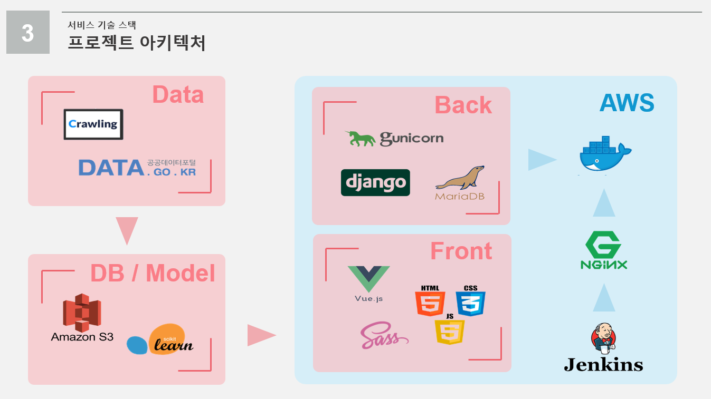

 <p align="center"></p>


## 👨‍👩‍👦팀원 소개

**차범희**

- 🧙‍♂️Github: [@Chabumhee](https://github.com/ssabum)

**김용재**

- 🍒Github: [@kimyoungjae](https://github.com/rubetyy)

**김윤빈**

- 🐶Github : [@kimyunbin](https://github.com/kimyunbin)

**이조순**

- 🌰Github: [@LEE JO SUN](https://github.com/KingBlackCow)

**임광훈**

- 🌰Github: [@ImGwanghun](https://github.com/Gwanghun-Im)


## 📆 프로젝트 개요

- 진행 기간 : 2021.08.30 ~ 2021.10.08

- 서비스명 : Best Trip Service
- 목표 : 빅데이터 전국 여행지 추천 서비스
  - 빅데이터를 통해 전국 여행지 만족도를 지도를 통해 보여줍니다. 
  - 각 주제별로 개인 성향에 맞는 여행지를 추천받을 수 있습니다. 
  - 추천받은 여행지에서 자신만의 경로를 제작하여 여행계획을 수립할 수 있습니다. 
  - 다른 사람들의 여행경로를 추천받을 수 있습니다.

- [와이어프레임](https://www.figma.com/file/MmuSdpHTD4IefO3OoraerG/Best-Trip-Service?node-id=9%3A10)
- [ERD](https://www.erdcloud.com/d/Y9BzoZx4ujvo9sFJN)
- [API](https://documenter.getpostman.com/view/17358365/U16eunu6)

<br>


## ✍ 프로젝트 소개

BTS는 빅데이터 기반 유저 맞춤형 여행지 추천 플랫폼입니다. 

여러분들이 여행지를 추천받으실 때 어떻게 하시나요? 인터넷 혹은 친구들에게 추천을 받지 않으신가요? 만족하시는 경험도 있겠지만, 그렇지 않은 경우도 존재 할 것입니다. 이것은 개인별 맞춤형 추천이 아니였기 때문입니다. 

그래서 저희는 ***60,966***명의 유저, ***59,017***개의 관광지, ***147,678***개의 이미지, ***144,045***개의 리뷰를 우리나라의 ***224***개의 지역으로 담았습니다. 

이러한 빅데이터는 유용하게 사용됩니다. 단 6개의 질문만으로도 여러분과 가장 잘 맞는 여행지를 알 수 있고, 단 1개의 리뷰만으로도 맞춤형 관광지를 추천 받을 수 있습니다. 떠나고 싶은 지역의 관광지를 미리 보며 여러분들의 여행 경로를 짤 수 있고, 다른 사람들의 경로를 추천 받을 수도 있습니다.

늘 즐거운 여행을 원하시나요 ? BTS에서 좀 더 만족한 여행을 즐겨보세요!


## ⭐️주요 기능

### 개인에 맞춘 지역 만족 추천 서비스 

> 회원가입시 단 6개의 추천으로 나와 맞는 최고의 지역을 추천해드립니다.  

- 
- 한국관광공사의 `국민여행조사 2020 국내여행` 을 기반으로 데이터 전처리 
- 상관 관계 분석으로 6개의 주요 변수 추출 
- 랜덤 포레스트 기반 모델

### 리뷰로 분석하는 최고의 관광지 추천 서비스  

> 1개만의 리뷰로도 빅데이터 기반 맞춤형 관광지를 추천해드립니다.

- 
- 한국관광공사의 `국문 관광정보 데이터 ` 에 존재하는 관광지 리뷰를 카카오에서 크롤링
- Cosine Similarity를 통한 유저간의 유사도 측정
- 98명의 페르소나로 차원 축소 
- SVD(특이값 분해) 모델 

### 나만의 여행경로

> 여행가기전에 경로를 미리 짜볼 수 있습니다. 

- 
- kakao map API 를 사용하여 지도를 보여줌
- 5가지 테마로 분류해 마커로 표시 
- 선택한 관광지를 기반으로 경로를 표시하고 저장


<br>

## ❔ 서비스 아키텍쳐




## 🎞 최종산출물

시연 영상

발표영상 pdf 


## 😋 Installation

- Frontend

```bash
$ cd frontend
$ npm i
$ npm run serve
```

- Backend

```bash
$ cd Backend
$ python -m venv venv
$ source venv/Scripts/activate
$ python manage.py requirements.txt
$ python manage.py loaddata init.json
$ python manage.py makemigrations
$ python manage.py migrate
$ python manage.py runserver

```


## ⚙ 개발 환경 및 IDE

- python : 3.8.10
- Django: 3.2.7
- Docker : 20.10.8
- node.js : 10.19.0


## 🐤 Server Description

- port (nginx)

  - 

    | 443  | server default(https)     |
    | ---- | ------------------------- |
    | 80   | server default(http)      |
    | 3306 | mariaDB                   |
    | 8000 | REST API (django running) |
    | 8082 | Jenkins                   |


---

### ✨Front-End 

- **지원 환경** : Web
- **담당자** : 김용재, 이조순, 차범희

<details>
    <summary>Front 자세히 살펴보기 🌈</summary>
    <ul>
        <li>기술스택 ⚙</li>
    </ul>   
    <ul>
        <li>JS, HTML, CSS</li>
        <li>SCSS</li>
        <li>Vue.js @2.6.11</li>
    </ul>
    <li>--------------------------------------------------------------------------------------</li>
    <ul>
        <li>라이브러리 📚</li>
    </ul>   
    <ul>
        <li>axios</li>
        <li>eslint & prettier</li>
        <li>node-sass</li>
        <li>sass-loader</li>
        <li>@fortawesome/fontawesome-svg-core</li>
        <li>@fortawesome/free-regular-svg-icons</li>
        <li>ant-design-vue</li>
        <li>aos</li>
        <li>bootstrap</li>
        <li>bootstrap-vue</li>
        <li>jwt-decode</li>
        <li>less-loader</li>
        <li>v-calendar</li>
        <li>vue-compare-image</li>
        <li>vue-easy-range-date-picker</li>
        <li>vue-google-login</li>
        <li>vue-infinite-loading</li>   
        <li>vue-typer</li>
        <li>vue2-datepicker</li>
        <li>vue2-daterange-picker</li>
        <li>vuejs-countdown</li>
        <li>vuelendar</li>
        <li>vuelidate</li>
        <li>vuetify</li>
        <li>vuetify-image-input</li>
        <li>vuex</li>
        <li>vuex-persistedstate</li>
        <li>webstomp-client</li>
        <li>d3</li>
        <li>jquery</li>
    </ul>
</details>


### 💻Back-End

- **담당자** : 김윤빈, 임광훈
<details>
    <summary>Front 자세히 살펴보기 🌈</summary>
    <ul>
        <li>기술스택 ⚙</li>
    </ul>   
    <ul>
        <li>Django</li>
        <li>AWS EC2</li>
        <li>Docker</li>
        <li>Jenkins</li>
        <li>Mariadb</li>
        <li>AWS S3</li>
    </ul>
    <li>--------------------------------------------------------------------------------------</li>
    <ul>
        <li>라이브러리 📚</li>
    </ul>   
    <ul>
        <li>Scikit-learn</li>
        <li>djangorestframework-jwt</li>
        <li>gunicorn</li>
        <li>numpy</li>
        <li>pandas</li>
        <li>django-rest-authtoken</li>
        <li>pymongo</li>
        <li>python-dateutil</li>
        <li>pytz</li>
        <li>requests</li>
        <li>scipy</li>
        <li>six</li>
        <li>sqlparse</li>
        <li>threadpoolctl</li>
        <li>urllib3</li>
        <li>TruncatedSVD</li>
        <li>svds</li>
    </ul>
</details>


