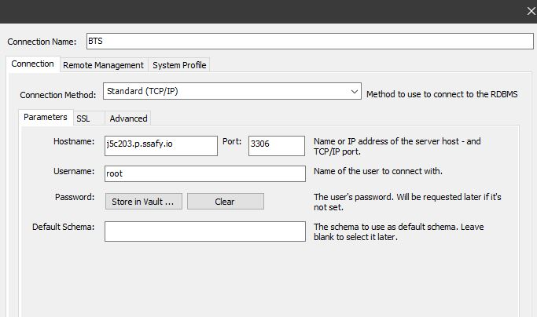

# 포팅 메뉴얼 


## 😋 Installation

- Frontend

```bash
$ cd frontend
$ npm i
$ npm run serve
```

- Backend

```bash
$ cd Backend
$ python -m venv venv
$ source venv/Scripts/activate
$ python manage.py requirements.txt
$ python manage.py loaddata init.json
$ python manage.py makemigrations
$ python manage.py migrate
$ python manage.py runserver

```


## ⚙ 개발 환경 및 IDE

- python : 3.8.10
- Django: 3.2.7
- Docker : 20.10.8
- node.js : 10.19.0


## 🐤 Server Description

- port (nginx)

  - 

    | 443  | server default(https)     |
    | ---- | ------------------------- |
    | 80   | server default(http)      |
    | 3306 | mariaDB                   |
    | 8000 | REST API (django running) |
    | 8082 | Jenkins                   |


## DB DumpData

```bash
$ python manage.py loaddata init.json
```

or 



